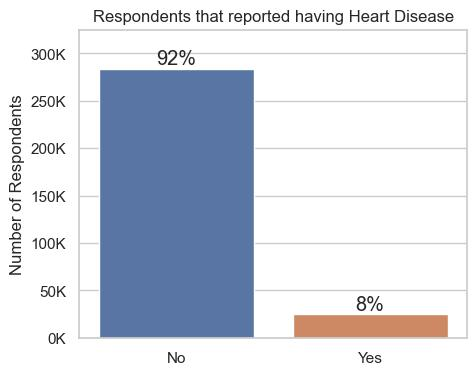
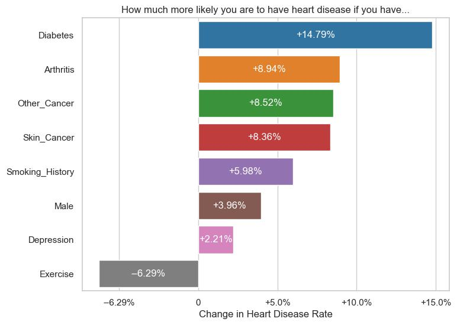

# Classification Project: Predicting Cardiovascular Disease
***

**Author:** Ron Lodetti Jr.


## Overview
***
This project uses machine learning and data from the CDC's [2021 Behavioral Risk Factor Surveillance System (BRFSS)](https://www.cdc.gov/brfss/annual_data/annual_2021.html) to help a hospital identify patients who would benefit from an educational program about heart health. After model iteration and hyperparameter tuning, our final model can **correctly predict about 81% of the people with a heart condition**, while only mislabeling about 29% of negative cases as positive. 

## Business Problem
***
Cardiovascular diseases are the [leading cause of death](https://en.wikipedia.org/wiki/List_of_causes_of_death_by_rate) worldwide except Africa. A hospital wants to be able to identify patients who are at risk of Cardiovascular disease (CVD) to begin taking preventative measures as early as possible. The hospital has developed a new online educational program and would like to recommend it to any patience at risk. 

## Data Understanding
***
This dataset, [from kaggle](https://www.kaggle.com/datasets/alphiree/cardiovascular-diseases-risk-prediction-dataset), is a cleaned version of the responses from the CDC's [2021 Behavioral Risk Factor Surveillance System (BRFSS)](https://www.cdc.gov/brfss/annual_data/annual_2021.html)

As you can see, we have 308,854 rows, each with 18 feature columns and 1 target column:

* `General_Health`: Respondent's reported general health
* `Checkup`: Time since respondent's last routine checkup
* `Exercise`: Participation in any physical activities or exercises in the past month
* `Heart_Disease`: **(Target)** Respondents that reported having coronary heart disease or myocardial infarction
* `Skin_Cancer`: Respondents that reported having skin cancer
* `Other_Cancer`: Respondents that reported having any other types of cancer
* `Depression`: Respondents that reported having a depressive disorder
* `Diabetes`: Respondents that reported having a diabetes
* `Arthritis`: Respondents that reported having an Arthritis
* `Sex`: Respondent's Gender
* `Age_Category`: Respondent's Age, by category
* `Height_(cm)`: Respondent's Height in centimeters
* `Weight_(kg)`: Respondent's Weight in kilograms
* `BMI`: Body Mass Index
* `Smoking_History`: Respondents that reported having a history of smoking cigarettes
* `Alcohol_Consumption`: Number of days, in the past 30 days, where respondent has had at least one alcoholic beverage
* `Fruit_Consumption`: Number of servings of fruit during the past 30 days
* `Green_Vegetables_Consumption`: Number of servings of vegetables during the past 30 days
* `FriedPotato_Consumption`: Number of servings of fruit during the past 30 days

Of our 12 categorical variables:
* There are 8 variables that have no order to them and will need to be OneHotEncoded.
* There are 3 ordinal variables, that is, categories which have an order. These include `General_Health`, `Checkup`, and `Age_Category`.



Our target variable is very imbalanced. We'll need to be sure to address this during data prep, modeling and evaluation.

Here is a visual representation illustrating the disparity in heart disease rates between individuals with a specific feature and those without it. For instance, approximately 6.06% of individuals without diabetes report experiencing a heart condition, whereas the rate is approximately 20.85% for those with diabetes, resulting in a substantial difference of approximately 14.79%.

- People with most of these features are more likely to also have Heart Disease
- Men are more likely to report having Heart Disease than women
- Exercise is the only feature listed that has a negative relationship with Heart Disease.

## Data Modeling
***
Since our stakeholder wants to identify as many people as possible who could have a heart condition and the cost of a false positive (identifying a person as likely to have a heart condition when they will not) is low, then we should **prioritize the true positive rate, or recall**. Given the imbalance in our dataset, I will use the f2-score as my evaluation metric. This is a weighted harmonic mean between precision and recall which gives more weight to recall. 

During model iteration, the following models were used and scored:
- DummyClassifier
- LogisticRegression
- RandomForestClassifier
- XGBClassifier **Final Model**

Given that this data is from a questionare, feature importance relates to questions being asked.


## Evaluation
***
Now that we have found the final model, I will score each of our models on the test data. 

|           name |    f2 | accuracy | precision | recall | roc_auc |
|---------------:|------:|---------:|----------:|-------:|--------:|
|    Dummy Model |  0.00 |    91.92 |      0.00 |   0.00 |   50.00 |
| Baseline Model |  7.50 |    91.94 |     51.39 |   6.18 |   83.41 |
|    Final Model | 49.87 |    72.25 |     19.86 |  80.14 |   83.27 |

The final model was the best performing model on the test data, capturing almost 81% of all of the positive cases. Given the over 300,000 data entries, lack of data leakage, and cross-validation done during training, I'm confident that this model would generalize. 


Based on this confusion matrix our model would correctly predict 81% of positive cases and 72% of negative cases. It would incorrectly predict 28% of negative cases as positive and 19% of positive cases as negative. 

## Conclusions
***
### Recommendations
Based on our final model I would make the following recommendations:
1. Develop a 6-question questionaire which would include questions about:
    - Arthritis
    - Diabetes
    - Age
    - General Health
    - Sex
    - Smoking History
<br>
<br>
2. Use an XGBClassifier model with the following parameters:
    - eta: 0.1
    - max_depth: 2
    - n_estimators: 400
    - reg_lambda: 10
    - reg_alpha: 0.1
    - min_child_weight: 1
    - gamma: 10
    - colsample_bytree: 3/7
    - tree_method: "hist"
    - scale_pos_weight: 212912/18728


### Limitations
- This model would not be as helpful in cases where the cost of a positve identification is increased, such as recommending a more invasive procedure, medication, or otherwise more expensive or cumbersome consequence.   
### Next Steps
- Determine with stakeholders the appropriate threshold to balance out true positive rate and false positive rate.
- Gather more data to see if there are other features which may help predict having a heart condition.
## For More Information

See the full analysis in the [Jupyter Notebook](./classification_project.ipynb) or review this [presentation](./classification_project_presentation.pdf).

For additional info, contact Ron Lodetti at [ron.lodetti@gmail.com](mailto:ron.lodetti@gmail.com)

## Repository Structure

```
├── code
│   ├── __init__.py
│   └── my_module.py
├── data
├── images
├── pickles
├── README.md
├── requirements.txt
├── classification_project_presentation.pdf
└── classification_project.ipynb


```


```python

```
